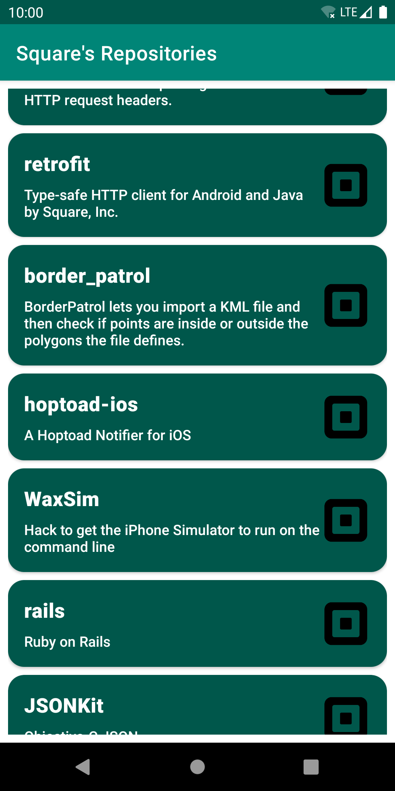
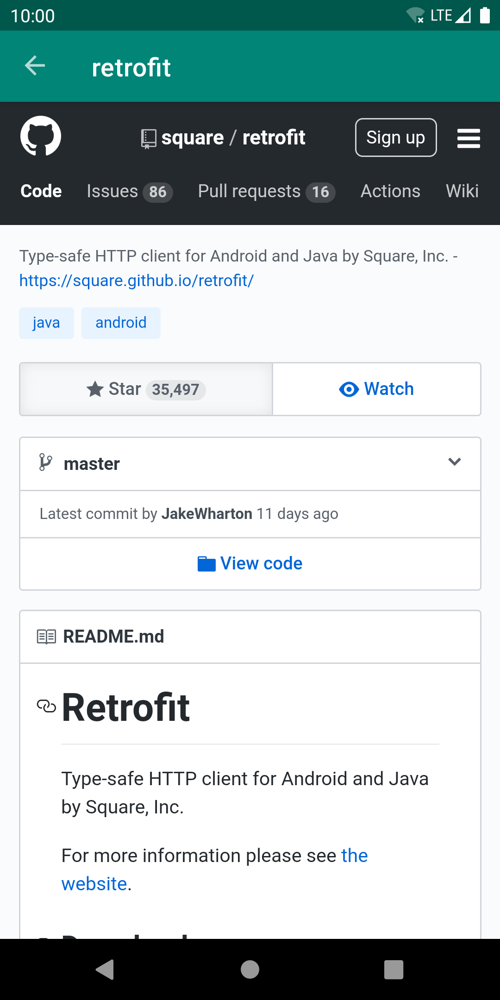

# Repo Browser
An Android application which displays a vertically scrollable list of [Square's](https://square.github.io/) open-source GitHub repositories.
Each list item displays the repository's title, description and owner avatar logo image. Tapping on a list item opens a detailed view of the repository, with a WebView which shows the associated HTML web page.

  

  

## Project Structure
Repo Browser is written entirely in Kotlin and uses the Gradle build system. It is currently made up of a single module: `app`.

## Architecture
The app adopts a single-Activity architecture, while making use of Fragments and the [Navigation Component](https://developer.android.com/guide/navigation) to handle navigation.

It follows the [Model–View–ViewModel (MVVM)](https://en.wikipedia.org/wiki/Model%E2%80%93view%E2%80%93viewmodel) pattern along with the recommendations from Google's [Guide to app architecture](https://developer.android.com/jetpack/docs/guide):
* The Views, represented by Android Fragments, are as lean as possible, handle only UI interactions and observe data through [LiveData](https://developer.android.com/topic/libraries/architecture/livedata) exposed by the ViewModel
* The [ViewModel](https://developer.android.com/topic/libraries/architecture/viewmodel) class is shared by both Views, and provides specific data for them, wrapped in an observable holder ([LiveData](https://developer.android.com/topic/libraries/architecture/livedata)) and communicates only with the Model, in order to retrieve and prepare the data for the UI
* The Model, represented by a Repository class, handles data operations off the Main (UI) thread, making use of [Kotlin Coroutines](https://kotlinlang.org/docs/reference/coroutines-overview.html) for asynchronous work, providing a clean API so that the rest of the app can retrieve this data easily

The networking layer is implemented using the [Retrofit](https://square.github.io/retrofit/) library and makes calls to [GitHub's v3 REST API](https://developer.github.com/v3/).

[Dagger-Android](https://dagger.dev/dev-guide/android.html) is used for dependency injection. The `di` package contains all DI-related classes. The [ApplicationComponent](/app/src/main/java/com/mircea/repobrowser/di/ApplicationComponent.kt) interface defines the Dagger modules used.

## Testing
Unit Tests exist for the presentation and data layers: [RepoBrowserViewModelTest.kt](/app/src/test/java/com/mircea/repobrowser/presentation/RepoBrowserViewModelTest.kt), [DefaultGitHubRepositoryTest.kt](/app/src/test/java/com/mircea/repobrowser/data/DefaultGitHubRepositoryTest.kt).

## Improvement ideas
* Use [paginated API calls](https://developer.github.com/v3/#pagination) along with the [Paging Library](https://developer.android.com/topic/libraries/architecture/paging) to load and display small chunks of data at a time, to reduce usage of network bandwidth and system resources
* Implement [searching functionality](https://developer.github.com/v3/search/)
* Set up [Travis CI](https://travis-ci.org/) for the project (include running unit tests)

## Work Management and Issue Tracking
A Kanban-style [Trello board](https://trello.com/b/rzB4ILMM/repo-browser-app) was used for organizing all project work.

## License
[GNU AGPLv3](LICENSE).
